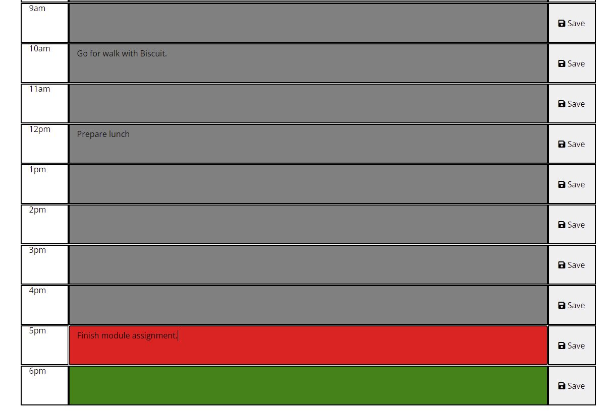

# Work Day Scheduler (Focus: jQuery, Moment.js, JavaScript)
###### GitHub Pages Deployment: https://jcomp-03.github.io/work-day-scheduler/

The purpose of this week's challenge is to build out a work day scheduler incorporating some jQuery, Moment.js, and JavaScript. Local storage is used so that the schedule information *persists* through webpage refreshes.

Below are a few screenshots which provide visual guide to how the program looks:

#### Gray coloring for past hours, red for present, green for future

